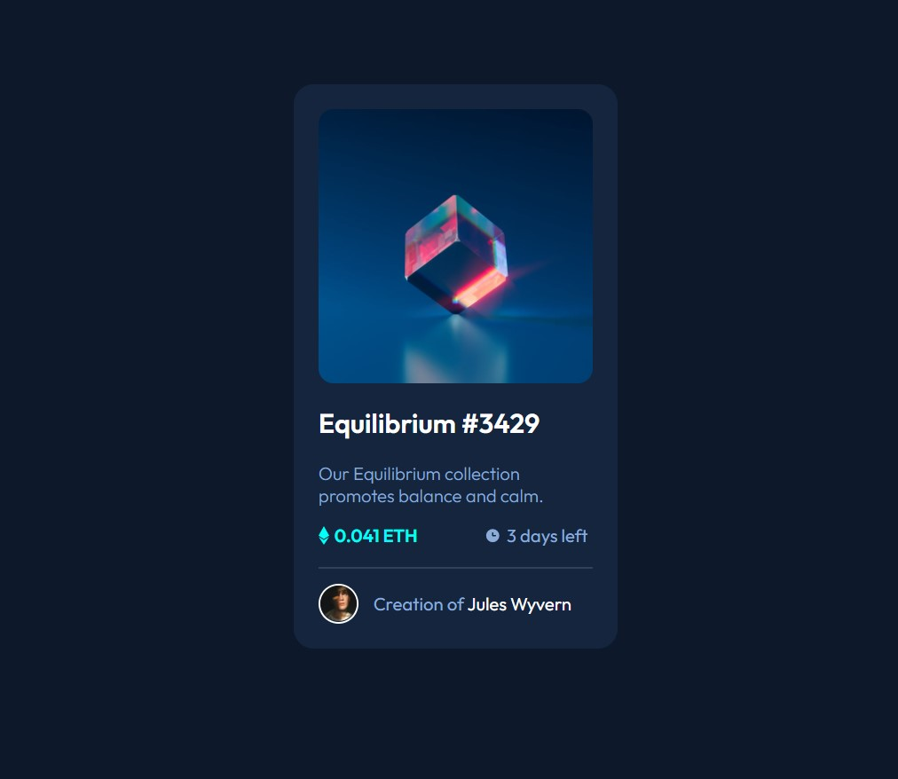

# Frontend Mentor - NFT preview card component solution

This is a solution to the [NFT preview card component challenge on Frontend Mentor](https://www.frontendmentor.io/challenges/nft-preview-card-component-SbdUL_w0U). Frontend Mentor challenges help you improve your coding skills by building realistic projects. 

## Table of contents

- [Overview](#overview)
  - [The challenge](#the-challenge)
  - [Screenshot](#screenshot)
  - [Links](#links)
- [My process](#my-process)
  - [Built with](#built-with)
  - [What I learned](#what-i-learned)
  - [Continued development](#continued-development)
  - [Useful resources](#useful-resources)
- [Author](#author)

## Overview

Building out a preview card component, with interactive (hover) elements.

### The challenge

Users should be able to:

- View the optimal layout depending on their device's screen size
- See hover states for interactive elements

### Screenshot

### Links

- Live Site URL: [Add live site URL here](https://your-live-site-url.com)

## My process

### Built with

- Semantic HTML5 markup
- CSS custom properties
- Flexbox

### What I learned

- How to add custom icons to HTML and edit those icons.
- More understanding of flexbox.
- Realizing I am coming up with various HTML/CSS styling solutions on my own; better use of my tools.
- More about nested tags that do not inherit parent styling.
- How to create an image overlay icon effect on hover.

### Continued development

- Responsive web design.
- When to best use padding vs margin.

### Useful resources

- Image Hover Text Overlay Effect with HTML & CSS - Web Design Tutorial [https://www.youtube.com/watch?v=exb2ab72Xhs](https://www.youtube.com/watch?v=exb2ab72Xhs), by dcode. This helped me find the simplest way to create an icon overlay hover effect with CSS. 

## Author

- Frontend Mentor - [@AliciaT08](https://www.frontendmentor.io/profile/AliciaT08)
